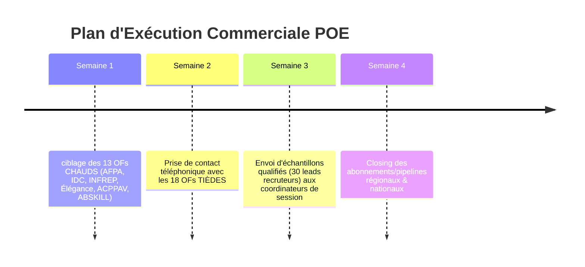

# 📊 ANALYSE STRATÉGIQUE & COMMERCIALE : LES ORGANISMES DE FORMATION POE (POEC & POA)

> **Document de Cadrage & Playbook de Conquête**  
> **Sujet :** Cartographie, Segmentation et Stratégie de Prospection des Organismes de Formation (OF) utilisateurs de Préparations Opérationnelles à l'Emploi (POEC / POAI)  
> **Auteur :** Julien FLORENCE — Direction Commerciale & Stratégie B2B  
> **Statut :** Livrable Actif — Version 1.0

---

## Executive Summary

Les **Préparations Opérationnelles à l'Emploi (POE)** — qu'elles soient collectives (**POEC**) ou individuelles (**POAI/POA**) — représentent un levier de chiffre d'affaires critique pour les Organismes de Formation (OF). 

Toutefois, le modèle économique de la POE repose sur un **point de blocage structurel** : **la POE ne se déclenche et ne se finance (via l'OPCO / France Travail) QUE si des entreprises s'engagent préalablement à embaucher les stagiaires à l'issue de la formation.**

Sans promesse d'embauche d'entreprises :
* **0 session ouverte**
* **0 financement OPCO débloqué**
* **0 € de Chiffre d'Affaires généré** pour l'organisme de formation.

Ce document établit la cartographie exhaustive des **88 organismes identifiés**, analyse leur typologie, décortique leurs douleurs commerciales et fournit la stratégie de conquête B2B basée sur la détection des signaux d'embauche d'entreprises.

---

## 1. COMPRÉHENSION DU MÉCANISME POE (POEC VS POA) & TRIANGLE DE DÉCISION

### 1.1 Le Triangle d'Or de la POE
```mermaid
graph TD
    A["OPCO / France Travail (Financement & Validation)"] -->|Financements conditionnés| B["Organisme de Formation (OF - Pédagogie & Session)"]
    B -->|Ingénierie & Salles| C["Candidats / Stagiaires"]
    D["Entreprises Recruteuses"] -->|Engagement d'Embauche (Condition N°1)| B
    D -->|Besoin en compétences| A
```

### 1.2 Distinctions Clés : POEC vs POA/POAI

| Caractéristique | POEC (Collective) | POA / POAI (Individuelle) |
| :--- | :--- | :--- |
| **Périmètre** | Session de groupe (5 à 15 stagiaires). | Candidat unique ciblé pour une entreprise précise. |
| **Financeurs** | OPCO de la branche professionnelle + France Travail. | France Travail (ex-Pôle Emploi) + OPCO en co-financement. |
| **Enjeu OF** | **Critique** : Réunir un pool d'entreprises s'engageant sur 5 à 15 embauches pour lancer la promo. | Ciblé : Valider le besoin unique d'un employeur pour l'apprenant. |
| **Risque Financier OF** | **Très Élevé** : Si 0 entreprise partenaire, toute la session de 15 personnes s'effondre. | Moyen : Dépend de l'accord d'un seul employeur. |
| **Opportunité Commerciale** | **Priorité Absolue** : Vente de fichiers qualifiés d'entreprises qui recrutent sur la branche. | Vente de leads entreprises ciblés par bassin d'emploi. |

---

## 2. CARTOGRAPHIE & SEGMENTATION DES 88 ORGANISMES DE FORMATION

L'analyse de la base de 88 organismes de formation identifiés sur le territoire national fait ressortir une segmentation par **Niveau de Chaleur / Volume de Sessions** et par **Typologie de Réseau**.

### 2.1 Répartition par Niveau de Chaleur Commerciale

```
┌─────────────────────────────────────────────────────────┐
│ Total Organismes Identifiés : 88                        │
├─────────────────────────┬───────────────────────────────┤
│ 13 CHAUDS (15%)         │ Multi-sessions (4 à 14 sessions)
│ 18 TIÈDES (20%)         │ Sessions régulières (2 à 3)  │
│ 57 FROIDS (65%)         │ Session ponctuelle / à activer│
└─────────────────────────┴───────────────────────────────┘
```

* **Accès Téléphonique** : 66 organismes sur 88 disposent d'un numéro de téléphone qualifié (12 Chauds, 4 Tièdes, 50 Froids).

---

### 2.2 Typologie des Grands Réseaux vs OF Spécialisés

#### A. Les Réseaux Nationaux & Mastodontes (Volume de Sessions Élevé)

1. **AFPA (Association nationale pour la formation professionnelle des adultes)**
   * **Sessions repérées** : 14 sessions (Leader national)
   * **Périmètre** : National
   * **Spécialité** : Industrie, BTP, Tertiaire, Logistique
   * **Spécificité Commerciale** : Numéro centralisé (3936). Nécessite d'identifier le coordinateur régional/centre.

2. **AFTRAL (Apprentissage et Formation Transport Logistique)**
   * **Sessions repérées** : 4 sessions
   * **Périmètre** : National
   * **OPCO de rattachement** : OPCO Mobilités
   * **Spécialité** : Transport routier, Logistique, Manutention

3. **ABSKILL**
   * **Sessions repérées** : 4 sessions
   * **Périmètre** : Auvergne-Rhône-Alpes, Bourgogne-Franche-Comté
   * **OPCO** : OPCO Mobilités, Constructys
   * **Spécialité** : Transport, Logistique, BTP, Industrie

#### B. Les Organismes Régionaux & Spécialisés (Cibles à Forte Réactivité)

| Organisme | Téléphone Direct | Sessions | Région / Bassin | Branche & OPCO Dominant |
| :--- | :---: | :---: | :--- | :--- |
| **IDC FORMATION** | 01 45 58 75 07 | **11** | Île-de-France | Tertiaire, Services, Commerce (OPCO EP / AKTO) |
| **INFREP** | 01 43 58 98 95 | **7** | IDF, Normandie | Insertion, Logistique, Services aux entreprises |
| **ÉLÉGANCE ACADÉMIE DE COIFFURE** | 09 53 69 32 83 | **5** | Occitanie | Coiffure, Esthétique, Beauté (OPCO EP) |
| **ACPPAV** | 01 39 22 10 60 | **4** | Île-de-France | Santé, Pharmacie, Sanitaire & Social |
| **CFA DE L'AUDE** | 04 68 11 22 00 | **3** | Occitanie | Artisanat, Métiers de bouche, BTP |
| **IFE-BAT** | 01 40 31 78 26 | **3** | Île-de-France | BTP, Second œuvre, Gros œuvre (Constructys) |
| **GRETA CÔTES NORMANDES** | 02 33 05 91 44 | **3** | Normandie | Éducation Nationale, Industrie, Tertiaire |
| **SIGMA FORMATION** | 04 91 29 63 80 | **3** | PACA | Service aux entreprises, Commerce, Transport |
| **INSTITUT DE FORMATION DE LA RÉUNION** | 02 62 20 03 92 | **3** | La Réunion | Outre-Mer, Tertiaire, Services |

---

## 3. LES 5 DOULEURS OPÉRATIONNELLES DES ORGANISMES DE FORMATION

Pour réussir la vente de fichiers d'entreprises auprès de ces organismes, la conversation commerciale doit appuyer précisément sur leurs 5 douleurs structurelles :

### 1. 🛑 "Sans employeur, la session ne part pas" (Douleur N°1 - Blocage de CA)
* *Mécanique* : L'OF peut avoir les locaux, le programme et les formateurs réservés. Si les entreprises ne signent pas les engagements d'embauche, l'OPCO ne débloque pas le budget. **Le chiffre d'affaires est bloqué par une tâche commerciale, pas pédagogique.**

### 2. 📇 "Le registre SIRENE / Qualiopi ne donne aucun interlocuteur"
* *Mécanique* : Les annuaires publics et bases achetées donnent un nom d'établissement et un code NAF. Ils ne disent pas QUI décide du plan de formation, ni le téléphone portable/direct du responsable RH ou Dirigeant.

### 3. 🎯 "Un code NAF décrit une catégorie, pas un moment d'embauche"
* *Mécanique* : Prospecter "toutes les entreprises du BTP" est inefficace. Ce qui fonctionne, c'est de contacter les entreprises qui **recrutent EN CE MOMENT** sur une fonction précise (ex: 2+ offres actives sur le même poste).

### 4. 🏛️ "La Branche professionnelle commande le financement (OPCO)"
* *Mécanique* : Le financement dépend de l'OPCO de raccordement. Aucune liste générique du marché ne comporte la colonne branche/OPCO reconstituée ligne par ligne.

### 5. ⏳ "Les équipes sont restreintes et débordées"
* *Mécanique* : Dans un OF, la personne qui prospecte les entreprises est souvent la même qui coordonne les sessions ou gère les candidats. Chaque heure passée à chercher des numéros est une heure perdue pour la vente de la session.

---

## 4. PLAYBOOK COMMERCIAL & SCRIPT DE PROSPECTION TÉLÉPHONIQUE

### 4.1 La Structure du Pitch en 4 Temps


#### Étape 1 : L'Accroche
> *"Bonjour [Dirigeant / Coordinateur], [Prénom] de la part de Romain Mention. Je vous appelle à froid, vous ne m'attendez pas. Je vous contacte parce que j'ai vu que chez [Organisme] vous montiez des POEC sur [Secteurs] en [Région]. Vous me donnez 30 secondes pour vous dire pourquoi, et vous décidez si on continue ?"*

#### Étape 2 : Le Pont (Question Douleur)
> *"Sur vos POEC, ce qui prend le plus de temps en général, c'est de trouver les entreprises qui s'engagent à embaucher à la sortie. Vous en êtes où là-dessus pour vos prochaines sessions ?"*

#### Étape 3 : Le Pivot (La Preuve Client - BK Concept)
> *"La raison de mon appel : on a mis en place un système automatisé pour BK Concept dans le travail temporaire. Il lit chaque semaine les offres d'emploi publiées et fait ressortir les entreprises qui recrutent vraiment — 2 offres ou plus sur le même poste au même endroit — avec le dirigeant, son téléphone direct et son email. Pour vous, ça donnerait la liste exacte des entreprises de [Secteur] qui cherchent à recruter en ce moment sur [Région]."*

#### Étape 4 : La Sortie (Call to Action)
> *"Je ne vais pas vous détailler ça au téléphone. Romain prend 15 minutes avec vous pour regarder votre secteur et vous dire ce qu'il y trouve. Vous préférez plutôt début ou fin de semaine ?"*

---

### 4.2 Traitement des Objections Majeures

| Ce que dit l'interlocuteur | Ce qu'il faut répondre (Position Adulte & Factuelle) |
| :--- | :--- |
| **"On a déjà un fichier / la base SIRENE."** | *"Est-ce que votre fichier vous donne le nom exact du décideur et son numéro direct/portable, ou vous tombez sur le standard ?"* |
| **"On achète déjà des listes du commerce."** | *"Une liste achetée ne vous dit pas qui recrute aujourd'hui. Chez nous, 5 lignes sur 100 seulement passent le filtre : on écarte les 95 autres qui ne recrutent pas."* |
| **"C'est trop cher."** | *"Combien d'heures votre coordinatrice passe-t-elle à fabriquer un fichier à la main ? Notre système livre un fichier de travail directement exploitable par vos commerciaux."* |
| **"On forme sur du CPF / Particuliers."** | *"Dans ce cas, notre offre ne s'applique pas. Nous intervenons uniquement sur les POEC/POA où l'accord d'une entreprise est obligatoire."* |
| **"Envoyez-moi une documentation."** | *"Entendu, mais pour vous envoyer le bon échantillon : sur vos prochaines sessions, quel est le secteur où il vous manque le plus d'entreprises ?"* |

---

## 5. RÈGLES D'OR & DÉLIMITATIONS DE L'OFFRE

> [!CAUTION]
> **Ce qu'il ne faut JAMAIS promettre au prospect :**
> 1. **Pas de candidats / stagiaires** : Le système trouve des **entreprises recruteuses**, pas des apprenants.
> 2. **Pas de promesse "la liste des entreprises qui font des POE"** : Une POE montée n'apparaît dans aucune source publique. On détecte les entreprises **qui recrutent**, qui sont les candidates parfaites pour une POE.
> 3. **Pas de B2C / CPF** : Ni reconversion individuelle, ni financement CPF.
> 4. **Exclusion des professions libérales fermées** : Ne pas prospecter les cabinets dentaires ou d'avocats à froid.
> 5. **Plafond d'emails à 33%** : Le canal téléphonique (77% de numéros directs) prime sur le canal email.

---

## 6. PLAN D'ACTION COMMERCIAL & SUIVANT



---

### ❓ Questions d'itération stratégiques :
1. Souhaitez-vous que nous générions la version HTML interactive avec dashboard de filtrage pour les **88 Organismes de Formation** ([Analyse_Organismes_Formation_POE_POEC.html](file:///Users/admin/Desktop/geminicli-backup/04_Livrables/HTML/Analyse_Organismes_Formation_POE_POEC.html)) ?
2. Voulez-vous qu me basant sur la base des 88 OFs, nous préparions un script Python de qualification automatique pour enrichir leurs dirigeants ou leurs OPCOs de rattachement ?
