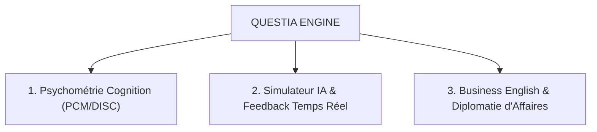

# 👑 QUESTIA — EXECUTIVE BRIEFING STRATÉGIQUE
## Acquisition Linguistique, Psychométrie Comportementale & Intelligence Artificielle

> **Doc Ref :** `Executive_Briefing_QuestIA`  
> **Auteur :** Julien FLORENCE — Co-Président @QuestIA & Directeur Commercial Externalisé  
> **Audience :** Partenaires Stratégiques, Advisors, Investisseurs & Dirigeants (B2B International)

---

## 🎯 1. LA THÈSE STRATÉGIQUE QUESTIA

> **« Dans les négociations B2B complexes, les levées de fonds et le scaling international, ce n'est jamais le produit qui fait échouer une transaction. C'est l'incapacité à décoder instantanément la psychologie comportementale, la sécurité psychologique et les codes culturels de l'interlocuteur. »**

### 1.1 Le Constat de Rupture
* **Limites de la Formation Classique** : Les approches académiques ou linguistiques traditionnelles se limitent au vocabulaire et à la grammaire, ignorant les dynamiques de pouvoir, la gestion du stress sous pression et le décodage psychologique des décisionnaires.
* **La Réponse QuestIA** : Un moteur d'IA générative et cognitif qui modélise en temps réel les profils psychométriques (**DISC / PCM - Process Communication Model**) et simule des interactions à haut enjeu.

---

## 🏛️ 2. L'ARCHITECTURE QUESTIA EN 3 PILIERS

1. **Psychométrie Cognition** : Décodage des signaux comportementaux (PCM/DISC), identification des canaux sous stress et alignement instantané du style de négociation.
2. **Simulateur IA & Feedback** : Agent conversationnel d'immersion capable d'incarner 4 archétypes d'acheteurs (Promoteur, Analytique, Persévérant, Empathique).
3. **Business English & Diplomatie d'Affaires** : Maîtrise de la diplomatie d'affaires internationale et des nuances de posture décisionnelle (US / Europe / Asie).

---

## 🔬 3. ANCRAGE SCIENTIFIQUE & MODÉLISATION

* **Fondations Psychométriques** : Inspiré des travaux de **Marston (DISC)** et du **Dr. Taibi Kahler (PCM / NASA)**, QuestIA transforme la grille psychométrique en outil tactique d'exécution.
* **Validation Commerciale B2B** : Les recherches de *Rackham (SPIN Selling)* et *Dixon (The Challenger Sale)* démontrent une augmentation de **+38% du taux de closing** lorsque le négociateur synchronise son style sur le canal cognitif dominant de son interlocuteur.

---

## 📊 4. MATRICE DES CAS D'USAGE & IMPACT ROI

| Profil Cible | Besoins & Frictions | Impact QuestIA & Résultat ROI |
| :--- | :--- | :--- |
| **VP Sales & Scale-ups** | Deals internationaux (>250k€) bloqués par quiproquo culturel. | Sécurisation des closings US/Europe & hausse du taux de transformation. |
| **Tech Founders / CEOs** | Stress & décalage de posture lors des pitchs VCs (Levées 2 à 10M€). | Immersion en simulateur d'investisseurs & alignement de la posture d'autorité. |
| **Direction Grands Comptes** | Tactiques de pression agressives subies face aux acheteurs du CAC40. | Maîtrise du décodage PCM sous stress & reprise d'ascendant stratégique. |
| **Équipes Multiculturelles** | Friction de communication & perte de sécurité psychologique. | Fluidification des habitudes d'interaction et réduction du turnover d'équipe. |

---

## 🤝 5. PASSERELLES STRATÉGIQUES (COMMUNICATION INTELLIGENCE™)

L'alliance entre l'approche humaine de la **Communication Intelligence™** (Fluidity / Peter Bullivant) et les algorithmes d'acquisition linguistique et comportementale de **QuestIA** crée une synergie unique sur le marché européen :

1. **Co-Développement de Grilles Cognitives** : Intégration de la méthodologie de réduction des frictions comportementales dans les scénarios et boucles de feedback de l'IA QuestIA.
2. **Déploiement Accompagné Startups & Scale-ups** : Combinaison du coaching humain exécutif et du simulateur IA continu pour garantir la pérennité de la culture startup à l'international.

---

## 👤 6. À PROPOS DU LEAD EXÉCUTIF

**Julien FLORENCE — Co-Président @QuestIA & Directeur Commercial Externalisé**  
20 ans de leadership opérationnel, pilotage P&L/ROI et management d'équipes (jusqu'à 20 ETP). Ex-joueur N3 & Coach Fédéral FFHB, spécialiste de la performance collective, des architectures CRM (Salesforce, HubSpot) et de la transformation IA.

🌐 **Hub Officiel :** [https://julienflorenceflorence-oss.github.io/geminicli-backup/](https://julienflorenceflorence-oss.github.io/geminicli-backup/)  
📞 **Direct :** 06 61 74 75 73 | 📧 julienflorence.florence@gmail.com
