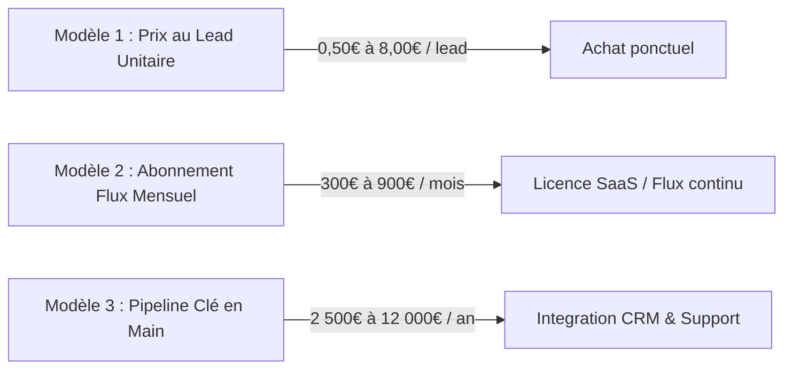
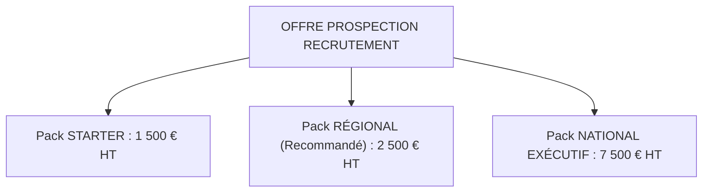

# 💰 ÉTUDE DE PRIX & DISPOSITION À PAYER : FICHIERS ET PIPELINES D'ENTREPRISES QUI RECRUTENT

> **Document Stratégique de Pricing & Modélisation ROI**  
> **Sujet :** Tarifs du marché et disposition à payer des entreprises (OF, CFAs, Agences d'Intérim, Écoles) pour des listes d'entreprises qui recrutent (Salariés, Alternants, Stagiaires)  
> **Auteur :** Julien FLORENCE — Direction Commerciale & Stratégie B2B  
> **Statut :** Livrable Actif — Version 1.0

---

## Executive Summary

La valeur d'une donnée d'entreprise ne réside pas dans sa quantité, mais dans son **signal d'activité (Intent Data)** et sa **capacité à générer du chiffre d'affaires immédiat pour l'acheteur**.

Une liste d'entreprises générique (ex: registre SIRENE / Kompass) se vend **0,10 € à 0,30 € le contact**.  
À l'inverse, une liste d'entreprises **détectées en phase active de recrutement** (2+ offres ouvertes, effectifs en hausse), enrichie avec le **numéro direct/portable du dirigeant ou du DRH** et rattachée à sa branche/OPCO, se vend entre **2 500 € HT et 12 000 € HT sous forme de pipeline ou forfait annuel**.

Pour un Organisme de Formation ou un CFA, placer **un seul alternant ou lancer une seule promo POEC rentabilise immédiatement l'achat (ROI de 3x à 10x).**

---

## 1. GRILLE TARIFAIRE DES 3 MODÈLES DU MARCHÉ



### 1.1 Modèle 1 : Prix au Lead Qualifié Unitaire (Pay-Per-Lead)

| Niveau de Qualification de la Donnée | Prix Marché Moyen | Composition de la Fiche |
| :--- | :---: | :--- |
| **Lead Brut (Base Sirene / Annuaire)** | 0,08 € - 0,20 € | Raison sociale, Adresse, Tel Standard, Code NAF. |
| **Lead Enrichi B2B Classique** | 0,30 € - 0,80 € | Nom du Dirigeant, Email générique/nominatif, Tel fixe. |
| **Lead avec Signal de Recrutement (Intent)** | **1,50 € - 3,50 €** | **Postes ouverts repérés, Dirigeant/DRH nommé, Tel direct.** |
| **Lead Recrutement Pénurique / Cadres** | **4,00 € - 8,00 €** | **IT, BTP, Transport, Industrie, Tel portable vérifié.** |
| **Lead Chaud Pré-qualifié (Rendez-vous)** | **25,00 € - 75,00 €** | Entreprise ayant confirmé au téléphone un besoin immédiat. |

---

### 1.2 Modèle 2 : Abonnement Flux Mensuel (Licence SaaS / Moteur de Détection)

* **Formule Solo / Indépendant** : **150 € à 350 € HT / mois** (Accès à 500 crédits de détection d'offres/mois).
* **Formule Équipe (3 à 5 Chargés de Relations Entreprises / Commercial ETT)** : **500 € à 900 € HT / mois** (Accès illimité aux signaux de recrutement régionaux + intégration CRM).
* **Formule Réseau National** : **1 500 € à 3 000 € HT / mois** (Alimentation multi-sites et multi-branches).

---

### 1.3 Modèle 3 : Pipeline Régional / National Clé en Main (Forfait avec Accompagnement)
*C'est le modèle pratiqué dans le brief commercial avec la cliente BK Concept (Intérim).*

* **Pipeline Régional (ex: Île-de-France ou Occitanie)** : **2 500 € HT** (Ticket d'entrée setup + alimentation continue sur 6 mois pour 8 départements).
* **Pipeline National Complété (Toute la France / Multi-secteurs)** : **7 500 € HT à 12 000 € HT** (Accompagnement 6 à 12 mois, ~80 000+ leads livrés directement dans le CRM client).

---

## 2. LA DISPOSITION À PAYER (WILLINGNESS TO PAY) PAR SEGMENT ACHETEUR

### 2.1 Segment 1 : CFAs & Organismes d'Alternance (Apprentissage & Contrat de Pro)
* **Objet acheté** : Entreprises qui recrutent des Alternants ou des Juniors.

```
┌───────────────────────────────────────────────────────────┐
│ ROI CFA :                                                 │
│ 1 Alternant non placé = PERTE de 6 000 € à 10 000 € OPCO  │
│ 1 Fichier à 2 500 € qui permet de placer 4 alternants     │
│ = GAIN NET DE 24 000 € (ROI x10)                          │
└───────────────────────────────────────────────────────────┘
```

* **Disposition à Payer (WTP)** :
  * **Prix Acceptable** : **2 000 € à 4 500 € HT / an** par centre de formation ou par filière.
  * **Frein majeur** : Ils refusent d'acheter du "volume mort". Ils exigent le téléphone portable/direct du responsable RH ou du tuteur d'alternance.

---

### 2.2 Segment 2 : Organismes de Formation POE (POEC / POA)
* **Objet acheté** : Entreprises s'engageant à embaucher pour lancer des sessions collectives (5 à 15 personnes).

* **Calcul de ROI** :
  * Si la session POEC de 12 personnes ne se lance pas = **30 000 € de chiffre d'affaires perdu**.
  * Un fichier qualifié d'entreprises recruteuses débloque l'ouverture de la session.
* **Disposition à Payer (WTP)** :
  * **Prix Acceptable** : **2 500 € HT (Régional)** à **7 500 € HT (National)** en forfait unique avec 6 mois d'accompagnement.

---

### 2.3 Segment 3 : Agences d'Intérim (ETT) & Cabinets de Recrutement
* **Objet acheté** : Entreprises qui recrutent des Salariés (CDD, CDI, Intérim).

* **Calcul de ROI** :
  * Un contrat de placement salarié / délégation intérim génère de **1 500 € à 5 000 € de marge nette**.
  * Les agences d'intérim ont des commerciaux terrain dédiés qui ont besoin de savoir **"qui appeler ce matin"**.
* **Disposition à Payer (WTP)** :
  * **Prix Acceptable** : **500 € à 1 200 € HT / mois** par agence locale, ou **10 000 € à 25 000 € HT / an** pour un réseau multi-agences.

---

### 2.4 Segment 4 : Écoles Supérieures & Business Schools (Stages & 1er Emploi)
* **Objet acheté** : Entreprises qui recrutent des Stagiaires de fin d'études ou des Jeunes Diplômés.

* **Calcul de ROI** :
  * Les taux d'insertion professionnelle conditionnent les accréditations (CTI, CEFDG, AACSB) et l'attractivité des étudiants payant 8 000 € à 15 000 € de frais de scolarité.
* **Disposition à Payer (WTP)** :
  * **Prix Acceptable** : **3 000 € à 8 000 € HT / an** pour le Service Carrières / Placement.

---

## 3. RECOMMANDATION DE GRILLE TARIFAIRE OFFICIELLE

Pour maximiser la conversion commerciale, voici la structure de prix recommandée pour commercialiser vos fichiers d'entreprises recruteuses :



### 📦 Pack 1 : STARTER (Test Métier) — **1 500 € HT**
* **Inclus** : 1 Département / 1 Filière précise.
* **Volume** : 300 à 500 leads qualifiés avec signaux de recrutement.
* **Livraison** : Fichier CSV / Excel enrichi avec suivi des relances.
* **Cible** : Petits organismes de formation, CFA indépendant local.

### 📦 Pack 2 : RÉGIONAL POWER (Le Best-Seller) — **2 500 € HT**
* **Inclus** : 1 Région entière (ex: Occitanie ou Île-de-France) / Toutes filières.
* **Volume** : Pipeline dynamique alimenté pendant 6 mois (~3 000 à 5 000 leads).
* **Enrichissement** : 77% Téléphone direct / Portable, 75% Dirigeant/RH nommé, 33% Email.
* **Cible** : Organismes POEC, CFAs régionaux, Agences d'intérim locales.

### 📦 Pack 3 : NATIONAL ENTERPRISE — **7 500 € HT**
* **Inclus** : France entière / Toutes branches professionnelles & OPCOs rattachés.
* **Volume** : 50 000 à 100 000 leads livrés en flux continu directement dans le CRM du client.
* **Accompagnement** : 6 mois d'ajustement du pipeline + qualification sur-mesure.
* **Cible** : Grands réseaux (AFPA, AFTRAL, ABSKILL, Enseignement Supérieur, Sièges ETT).

---

## 4. ARGUMENTAIRE DE VENTE ROI (COMMENT JUSTIFIER LE PRIX)

Lorsque le prospect dit : *"C'est trop cher pour un fichier"*, voici la réponse à utiliser :

> **« Monsieur le Directeur, ce que vous achetez n'est pas un fichier au kilo, c'est l'assurance d'ouvrir vos sessions.**  
> **Combien vous coûte un alternant ou un stagiaire qui ne trouve pas d'entreprise et quitte votre établissement ? C'est 6 000 € à 9 000 € de chiffre d'affaires perdu par étudiant.**  
> **En vous livrant chaque semaine les entreprises qui recrutent en ce moment même avec le portable direct du dirigeant, 2 seuls placements réussis rentabilisent l'intégralité du pack de 2 500 €. Tout le reste, c'est de la marge pure pour votre centre. »**

---

### ❓ Questions d'itération stratégiques :
1. Souhaitez-vous que nous intégrions cette **Grille Tarifaire et Calculateur de ROI** directement dans le Dashboard HTML ([Analyse_Organismes_Formation_POE_POEC.html](file:///Users/admin/Desktop/geminicli-backup/04_Livrables/HTML/Analyse_Organismes_Formation_POE_POEC.html)) ?
2. Voulez-vous qu me basant sur cette grille, nous rédigions la **Proposition Commerciale Type (Devis B2B & Bon de Commande 2 pages)** prête à envoyer aux CFAs et Organismes de Formation ?
