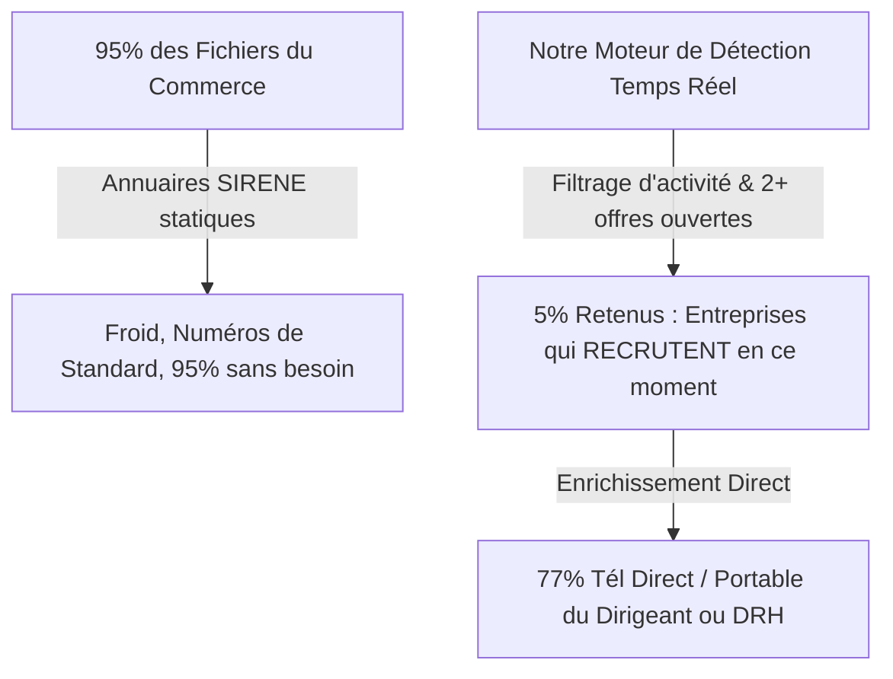
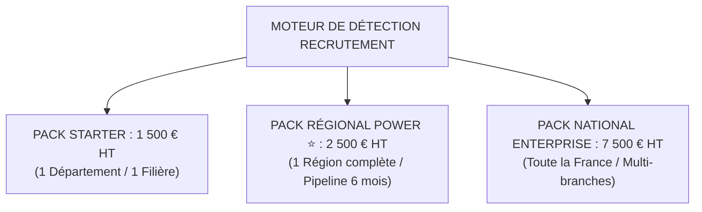

# 📜 PLAQUETTE COMMERCIALE OFFICIELLE : MOTEUR DE DÉTECTION D'ENTREPRISES EN RECHERCHE ACTIVE

> **Ce n'est pas de l'achat de fichier au kilo. C'est la détection en temps réel des entreprises qui recrutent EN CE MOMENT.**  
> **Auteur :** Julien FLORENCE — Co-Président @QuestIA & Direction Commerciale B2B  
> **Contact Direct :** 06 61 74 75 73 | julienflorence.florence@gmail.com  
> **Hub Exécutif :** [https://julienflorenceflorence-oss.github.io/geminicli-backup/](https://julienflorenceflorence-oss.github.io/geminicli-backup/)

---

## ⚡ 1. LE CONSTAT : FICHIER MORT VS DÉTECTION D'INTENTION

| Fichiers Classiques du Commerce | Notre Moteur de Détection Temps Réel |
| :--- | :--- |
| ❌ Fichiers statiques tirés du registre SIRENE/NAF. | ✅ Détection automatique des offres d'emploi ouvertes (2+ postes). |
| ❌ 95% d'entreprises ne recrutant pas aujourd'hui. | ✅ 5 lignes seulement sur 100 retenues après filtre d'activité. |
| ❌ Numéro de standard généraliste (barrage d'accueil). | ✅ **77% avec numéro direct / portable du dirigeant ou DRH.** |
| ❌ Aucune donnée sur la branche ou l'OPCO. | ✅ **Branche professionnelle & OPCO reconstitués ligne par ligne.** |

---

## 🎯 2. À QUI S'ADRESSE CE SERVICE ?

1. **CFAs & Organismes d'Alternance** : Placer vos étudiants en contrat d'apprentissage et débloquer les financements OPCO (6k€-10k€ par étudiant) avant la date limite.
2. **Organismes de Formation POE (POEC / POA)** : Obtenir les promesses d'embauche d'entreprises indispensables à l'ouverture de vos promotions.
3. **Agences d'Intérim & Recrutement (ETT)** : Donner chaque matin à vos commerciaux la liste des entreprises qui cherchent des salariés en urgence.
4. **Écoles Supérieures & Business Schools** : Alimenter votre service carrières en opportunités de stages de fin d'études et 1er emploi.

---

## 💰 3. OFFRES & GRILLE TARIFAIRE OFFICIELLE

### 📦 PACK STARTER (Test Métier ou Local) — **1 500 € HT**
* **Inclus** : 1 Département / 1 Filière ciblée.
* **Volume** : 300 à 500 Entreprises détectées en recrutement actif.
* **Données** : Coordonnées Dirigeant/RH directes + Tél direct.
* **Livraison** : Fichier CSV/Excel prêt à prospecter.

### 📦 PACK RÉGIONAL POWER (Le Best-Seller ⭐) — **2 500 € HT**
* **Inclus** : 1 Région entière (ex: Occitanie ou Île-de-France) / Toutes filières.
* **Volume** : Pipeline dynamique alimenté en continu pendant 6 mois (3 000 à 5 000 entreprises qualifiées).
* **Enrichissement** : 77% Tél Direct / Portable, 75% Dirigeant/DRH nommé, Branche & OPCO reconstitués.
* **Accompagnement** : Suivi & ajustement du pipeline par nos équipes.

### 📦 PACK NATIONAL ENTERPRISE — **7 500 € HT**
* **Inclus** : France Entière / Toutes branches professionnelles.
* **Volume** : 50 000+ à 100 000 Leads livrés en flux continu.
* **Intégration** : Flux automatisé poussé directement dans le CRM client (HubSpot, Salesforce).
* **Accompagnement** : 6 à 12 mois d'accompagnement dédié.

---

## 🧮 4. CALCULATEUR DE RENTABILITÉ IMMÉDIATE (LE ROI NO-BRAINER)

> **Un seul alternant non placé représente une perte de 6 000 € à 9 000 € de budget OPCO pour votre centre.**  
> **Une promo POEC annulée représente 30 000 € de CA perdu.**  
> **En souscrivant au Pack Régional à 2 500 € HT, 2 seuls placements réussis rentabilisent l'intégralité de votre investissement. Tout le reste est de la marge pure.**

---

## 📲 5. CONTACT & RÉSERVATION

* **Julien FLORENCE** — Co-Président @QuestIA & Direction Commerciale B2B
* 📞 **Direct :** 06 61 74 75 73
* 📧 **Email :** julienflorence.florence@gmail.com
* 🌐 **Hub Exécutif :** [https://julienflorenceflorence-oss.github.io/geminicli-backup/](https://julienflorenceflorence-oss.github.io/geminicli-backup/)
