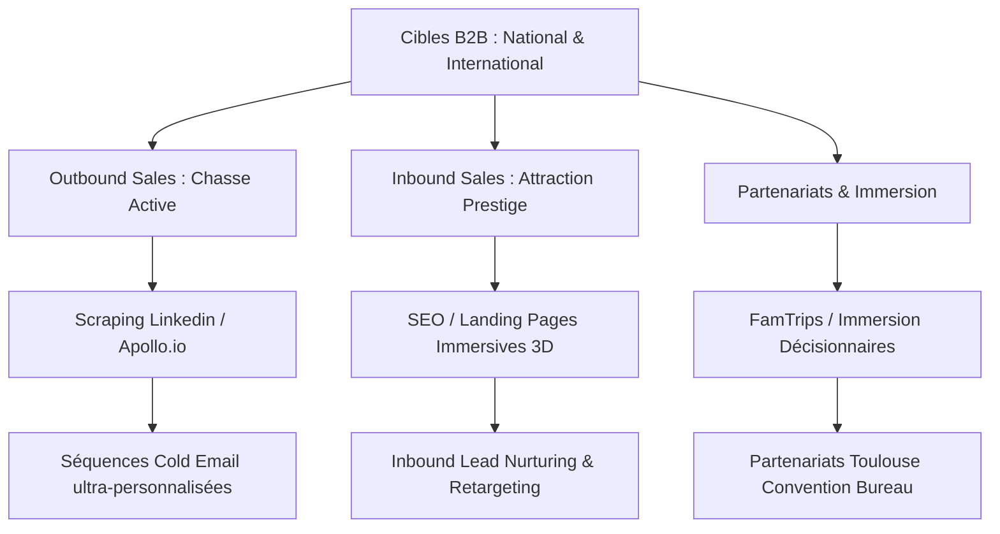

# ⚜️ PLAN STRATÉGIQUE D'ACQUISITION CLIENT B2B
## Remplissage MICE National & International — Grand Hôtel Capitole by Orso

> [!NOTE]
> Ce plan d'action combine les techniques d'**Acquisition Tech (Rocket School)** et les codes de l'**Hôtellerie de Prestige**. L'objectif est d'assurer un taux d'occupation optimal des espaces séminaires, de la cour intérieure paysagée et de l'hébergement d'affaires.

---

## 🎯 1. Définition des Profils Clients Idéaux (ICP)

Pour remplir l'établissement toute l'année, nous segmentons nos cibles en trois catégories majeures à forte valeur ajoutée :

| Segment | Cible Nationale | Cible Internationale |
| :--- | :--- | :--- |
| **Grands Comptes & Corporate** | - Directeurs Com, RSE, RH, Assistant(e)s de Direction. - Entreprises du CAC 40 & ETI à forte présence locale (Aéronautique, Santé, Tech, Énergie). | - Multinationales étrangères avec filiales ou sous-traitants en Occitanie (Europe, USA). - Sièges sociaux européens organisant des séminaires hors-murs. |
| **Agences Événementielles / MICE** | - Agences MICE parisiennes et lyonnaises organisant des séminaires d'affaires dans le Sud-Ouest. | - Agences événementielles haut de gamme et DMC (Destination Management Companies) basées au Royaume-Uni, Allemagne, Bénélux, Espagne. |
| **Lancement de Produits & Réceptions** | - Marques de luxe nationales (Mode, Joaillerie, Automobile haut de gamme) cherchant un lieu d'exception à Toulouse. | - Agences RP et de relations publiques internationales. - Clubs d'affaires bilatéraux internationaux (ex: Franco-Allemand, Franco-Américain). |

---

## 🚀 2. Stratégie Outbound Sales (Chasse & Growth Hacking MICE)

L'objectif est d'aller chercher directement les décideurs nationaux et internationaux en utilisant une stack d'acquisition moderne.

### Étape 1 : Extraction de données & Constitution du fichier prospects
* **Stack d'outils** : *LinkedIn Sales Navigator* + *Apollo.io* (ou *Lusha*) pour extraire les adresses e-mail professionnelles directes et nominatives.
* **Critères de ciblage** :
  * *Rôles* : "Executive Assistant", "Office Manager", "Directeur de la Communication", "Responsable MICE", "Chef de Projet Événementiel", "Directeur Général" (pour les PME/ETI).
  * *Secteur* : Aéronautique, E-commerce, Conseil, IT, Cosmétique, Luxe.
  * *Géographie* : Paris Île-de-France (National), Londres, Francfort, Amsterdam, Bruxelles, Madrid (International).

### Étape 2 : Campagnes de Cold Emailing de Prestige (Séquence Multi-Canal)
Les emails de prospection hôtelière classique sont souvent trop génériques. Nous appliquons la méthode de l'**Email de Prestige** : court, ultra-ciblé, axé sur l'exclusivité du lieu.

> [!TIP]
> **Exemple de pitch d'approche (National) :**
> *« Bonjour [Prénom], le renouveau du Grand Hôtel Capitole Toulouse prend forme. Pour vos comités de direction ou événements d'affaires de la rentrée, nous ouvrons notre nouvelle cour intérieure paysagée au 1 Place du Capitole. Un écrin de calme 4 étoiles avec Spa et couloir de nage indoor en plein centre. Auriez-vous 5 minutes ce jeudi pour une visite virtuelle interactive de nos espaces ? »*

---

## 🌐 3. Stratégie Inbound Sales (Attraction & Immersion Digitale)

Capturer la demande entrante des entreprises et agences qui recherchent activement un lieu événementiel d'exception à Toulouse.

### A. Landing Pages de Prestige & Visites Virtuelles
* Créer une page de destination ultra-rapide et immersive spécifiquement dédiée aux professionnels : **« Séminaires et Événements de Prestige au Capitole »**.
* Intégrer une **visite virtuelle 3D / 360° haute définition** de la salle de réunion, de la cour intérieure et du Spa pour permettre aux agences événementielles internationales de valider les espaces à distance (sans déplacement physique).

### B. Stratégie SEO MICE (Référencement Naturel)
Positionner le site internet sur des requêtes stratégiques à forte intention commerciale :
* *Mots-clés nationaux* : `lieu séminaire haut de gamme toulouse`, `privatisation cour intérieure toulouse`, `séminaire de direction prestige toulouse`.
* *Mots-clés internationaux* : `luxury business venue toulouse`, `mice hotel toulouse center`, `exclusive corporate events toulouse`.

---

## 🤝 4. Activation Terrain, Partenariats & Fidélisation

### A. L'Opération "FamTrip VIP" (Voyage de Familiarisation)
Pour convaincre les agences MICE internationales et nationales les plus influentes :
1. Sélectionner les **20 acheteurs/décideurs clés** identifiés lors de notre prospection Outbound.
2. Les inviter pour un **week-end d'immersion totale 4★** au Grand Hôtel Capitole (Hébergement, dîner gastronomique, cocktail exclusif dans la cour intérieure paysagée, test du Spa/couloir de nage).
3. Le coût de l'opération est rapidement amorti par la signature d'un seul contrat de séminaire (CA moyen d'un séminaire résidentiel de 3 jours pour 25 personnes : ~15 000 € à 20 000 €).

### B. Intégration Réseaux & Institutionnels
* Adhésion immédiate au **Toulouse Convention Bureau** (première porte d'entrée des demandes MICE internationales sur la métropole).
* Partenariat avec le **Club des Entreprises du Capitole** et les réseaux aéronautiques locaux (Airbus Club, Aerospace Valley) pour capter les dîners de gala et les lancements internes.

---

## 📈 5. Indicateurs de Performance (KPIs) & Objectifs à 6 mois

Pour piloter l'efficacité de cette stratégie d'acquisition, nous suivrons les indicateurs suivants :

| Catégorie | KPI Principal | Cible 6 mois |
| :--- | :--- | :--- |
| **Outbound** | Taux d'ouverture des emails de prospection | > 65 % |
| **Rendez-vous** | Visites virtuelles ou physiques MICE générées | 15 par mois |
| **Pipeline** | Taux de conversion des devis événementiels | > 35 % |
| **Volume d'affaires** | Chiffre d'affaires MICE et Groupes généré | + 120 000 € |
| **Notoriété** | Nombre d'agences MICE référencées en portefeuille actif | 50 agences |

---

## 💰 6. Budget d'Acquisition Prévisionnel & Analyse de ROI (Annuel)

L'estimation financière ci-dessous distingue les coûts technologiques de prospection des coûts réels de revient pour l'établissement lors des opérations d'immersion physique (FamTrips).

### A. Budget d'Acquisition Annuel

| Poste de Dépense | Description | Coût Annuel (HT) |
| :--- | :--- | :--- |
| **Stack Tech (Outbound)** | - LinkedIn Sales Navigator Core (960 €) - Apollo.io Professional (~950 €) - Dropcontact/Lusha (Enrichissement : 480 €) - Instantly/Lemlist (Cold Mailing : 600 €) | 2 990 € |
| **Opérations d'Immersion (FamTrips)** | - Coût marginal hébergement (20 nuitées 4★ : 600 €) - Restauration (Dîners, cocktails cour paysagée : 1 400 €) - Spa/Soins découverte (coût de revient : 300 €) - Welcome gifts (champagne, spécialités locales : 1 000 €) | 3 300 € |
| **Partenariats Réseaux** | Adhésion annuelle au Toulouse Convention Bureau (MICE) | 1 200 € |
| **TOTAL BUDGET ANNUEL** | **Investissement d'acquisition global** | **7 490 €** |

### B. Chiffre d'Affaires MICE Prévisionnel & Hypothèses de ROI

> [!IMPORTANT]
> **Hypothèses de paniers moyens MICE (Grand Hôtel Capitole by Orso) :**
> * **Séminaire Résidentiel National** (15 pers. sur 2 jours, CoDir/ETI) : **7 500 €**
> * **Séminaire Résidentiel International** (25 pers. sur 3 jours, Multinationales/Agences DMC) : **20 000 €**
> * **Comité de Direction restreint** (Outbound direct) : **4 500 €**

#### Objectifs de signatures à 12 mois (Taux de conversion estimé à 20 % sur les VIP invités en FamTrips) :
1. **Conversion FamTrips MICE** : 2 séminaires nationaux (15 000 €) + 2 séminaires internationaux (40 000 €) = **55 000 €**
2. **Chasse Outbound Directe** : 6 comités de direction signés à l'année = **27 000 €**
3. **Inbound SEO & Convention Bureau** : 4 séminaires corporatifs signés à l'année (~8 000 € de panier moyen) = **32 000 €**

* **CHIFFRE D'AFFAIRES BRUT ESTIMÉ (AN 1)** : **114 000 €**

### C. Calcul du ROI (Return On Investment)

$$\text{ROI} = \frac{\text{CA Généré} - \text{Budget d'Acquisition}}{\text{Budget d'Acquisition}}$$

$$\text{ROI} = \frac{114\ 000\ \text{€} - 7\ 490\ \text{€}}{7\ 490\ \text{€}} \approx \mathbf{14{,}2}$$

> [!TIP]
> **Indicateur de Rentabilité MICE :**
> Pour chaque **1 € investi** dans cette stratégie d'acquisition B2B, le Grand Hôtel Capitole génère **14,20 € de chiffre d'affaires**. Ce ratio de rentabilité de **1 420 %** est extrêmement élevé et s'explique par la nature à forte marge des prestations événementielles et de l'hébergement de groupe en milieu de semaine.

