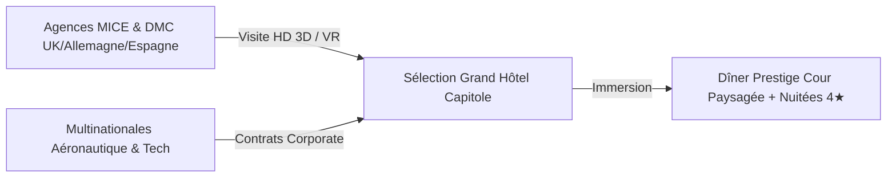

# ⚜️ PROPOSITION DE PROSPECTION STRATÉGIQUE (NATIONAL & INTERNATIONAL)
## Captation de la Clientèle Business Travel & MICE — Grand Hôtel Capitole by Orso

> [!IMPORTANT]
> **Données de cadrage macro-économique (Toulouse) :**
> * **73 %** des nuitées hôtelières à Toulouse proviennent de la clientèle affaires (CRT Occitanie).
> * **65 %** des 5 millions de nuitées marchandes de la métropole sont attribuées au Business Travel (Toulouse Team).
> * Cette proposition détaille les actions d'acquisition commerciale à mener sur les **4 piliers sectoriels majeurs** du territoire, à l'échelle nationale et internationale.

---

## 🗺️ 1. Plan de Prospection National (Cible France)

L'objectif national est de capter le flux d'affaires régulier (Corporate) et les événements d'envergure (MICE) en provenance de Paris et des grandes métropoles régionales.

### 🔴 A. Axe "Congrès, Salons & Conventions" (Le Premier Moteur MICE)
* **Cibles prioritaires** : Les comités d'organisation des grands événements du **MEETT** (Parc des Expositions) et du **Centre de Congrès Pierre Baudis**, ainsi que les 20 % d'exposants majeurs (grands comptes).
* **Actions de Prospection** :
  1. **Veille Calendrier** : Cartographier les salons professionnels à venir sur 12 mois (ex : *Aeromart*, *SIANE*, *Salon du Logement*).
  2. **Scraping Exposants** : Extraire la liste des entreprises exposantes nationales via les annuaires des salons.
  3. **Campagnes Outbound** : Contacter les Directeurs Marketing/Communication de ces entreprises 3 mois avant le salon pour proposer le Grand Hôtel Capitole comme "QG officiel" (Hébergement de l'équipe direction + Salon privé pour réceptions clients).
* **L'Offre Commerciale** : **Package "Exposant VIP"** (Chambre 4★, petit-déjeuner express, transfert privé vers le MEETT, et accès prioritaire au Spa pour récupération après le salon).

### 🔵 B. Axe "Aéronautique, Spatial & Ingénierie" (Paris-Toulouse)
* **Cibles prioritaires** : Sièges sociaux des équipementiers, sous-traitants et sociétés d'ingénierie majeurs basés à Paris (ex : *Safran*, *Thales*, *Latécoère*, *Capgemini*, *Alten*) ayant des flux permanents vers Airbus Toulouse.
* **Actions de Prospection** :
  1. **Chasse LinkedIn** : Cibler les "Travel Managers", "Responsables Achats Voyage" et "Office Managers" parisiens de ces structures.
  2. **Prospection Téléphonique / Visio** : Présenter la montée en gamme de l'hôtel (repositionnement 4★) et son emplacement ultra-central face au Capitole.
* **L'Offre Commerciale** : **Contrat Corporate Cadre** (Tarif négocié fixe toute l'année, sur-classement offert selon disponibilité, facturation centralisée simplifiée, et gratuité de la salle de réunion pour les réservations de plus de 10 nuitées/semaine).

---

## 🌍 2. Plan de Prospection International (Europe & Monde)

L'objectif international est de positionner le Grand Hôtel Capitole comme l'alternative de charme 4★ face aux grandes chaînes standardisées pour les réunions de direction et le tourisme d'affaires européen.



### 🇬🇧🇩🇪 A. Axe "Agences MICE & DMC Internationales" (Europe du Nord / Royaume-Uni)
* **Cibles prioritaires** : Agences de Business Travel et DMC basées à Londres, Munich, Francfort, Bruxelles et Amsterdam, spécialisées dans l'organisation d'événements de prestige pour le compte de grands groupes.
* **Actions de Prospection** :
  1. **Acquisition Digitale** : Séquences d'emailing automatisées en anglais présentant le nouvel écrin du Capitole (Mise en valeur visuelle de la cour intérieure paysagée, atout unique pour les réceptions en plein air sous le climat toulousain).
  2. **Démonstration Virtuelle** : Proposition de visites immersives 360° en visioconférence pour valider la logistique événementielle à distance.
* **L'Offre Commerciale** : **Package "MICE Prestige International"** (Hébergement haut de gamme, dîner privatisé dans la cour paysagée, soirée cocktail, et expérience de déconnexion totale au Spa).

### 🇺🇸🇪🇺 B. Axe "Partenariats Aéronautiques Internationaux"
* **Cibles prioritaires** : Délégations commerciales étrangères, acheteurs internationaux et partenaires d'Airbus (ex : compagnies aériennes mondiales venant prendre livraison d'appareils à Toulouse).
* **Actions de Prospection** :
  1. **Réseau Local** : Collaboration étroite avec le *Toulouse Convention Bureau* et la *Chambre de Commerce Internationale (CCI) Occitanie* pour capter les délégations officielles.
  2. **Partenariats de Livraison** : Contacter les départements "Protocol & Delivery" des constructeurs et sous-traitants pour loger les équipages et directions internationales lors des phases de livraison d'avions.
* **L'Offre Commerciale** : **Service "VIP Delivery"** (Accueil bilingue personnalisé, conciergerie dédiée 24/7, flexibilité totale sur les dates de séjour liées aux aléas industriels, et privatisation de la cour pour les cocktails de célébration).

---

## 📈 3. Planification Commerciale & Plan de Charge (12 Mois)

Pour exécuter cette double stratégie, les actions seront réparties selon la saisonnalité du marché MICE toulousain :

```
[Mois 1-3 : Phase Outbound] ──> Ciblage Grands Comptes & Scraping Exposants Salons
[Mois 4-6 : Phase Immersion] ──> Organisation des FamTrips (Printemps) & Lancement SEO
[Mois 7-9 : Phase Corporate] ──> Négociation des Contrats Cadres pour la rentrée
[Mois 10-12 : Phase Closing] ──> Signature des événements d'hiver et séminaires de fin d'année
```

### 🎯 Objectifs de Conversion du Plan de Prospection :
* **Corporate National** : Signer **15 contrats cadres** de fidélisation corporate d'ici la fin de l'année.
* **Événementiel National** : Capter **12 séminaires résidentiels** nationaux (15+ pers.) via les grands comptes de la tech et de l'aéronautique.
* **MICE International** : Référencer l'hôtel auprès de **25 agences DMC européennes** de premier plan et obtenir **5 séminaires internationaux** (20+ pers.).
